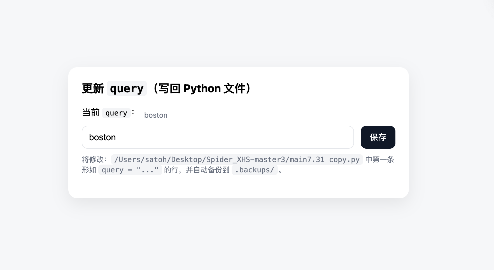

# Kapitalismus


[简介]

## Interface preview


## How to use
### Compile and run the project
1. Install dependencies
```bash
pip install -r requirements.txt
```
2. Configure environment variables in `.env` file, indicate the login cookie for Xiaohongshu.

3. Run the frontend script
```bash
python app.py
```
### Access the web interface
Open your browser and navigate to `http://localhost:5000` to access the graphical user interface.  
Run `python main.py` to start the backend service for querying the keyword.

## Credits
[Spider_XHS]('https://github.com/cv-cat/Spider_XHS'): Provides the core functionality for scraping data from Xiaohongshu.

