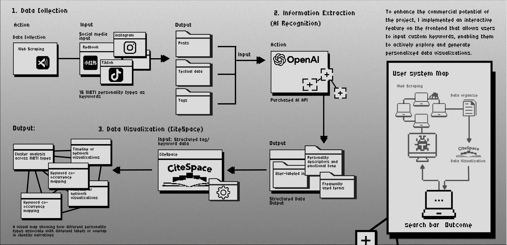
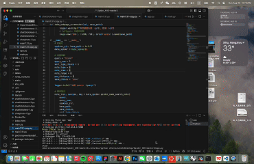
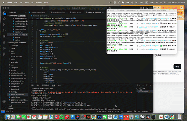

# Kapitalismus


【**Introduction**】
Kapitalismus is a visualization project built on large-scale social media data.
It leverages web scraping to collect users’ public images and captions, combined with API-based AI semantic analysis to structure the data. These structured features are then imported into CiteSpace to generate a visualized social tagging network.

Technical Pipeline
	•	Data Collection: Large-scale scraping using Python (requests/selenium), with proxy rotation and dynamic headers to bypass restrictions.
	•	Semantic Analysis: Multi-modal semantic decomposition of text and images via NLP and CV APIs.
	•	Data Structuring: Extracted social labels and semantic features are formatted for CiteSpace input.
	•	Visualization: Multi-layered network visualization in CiteSpace to reveal the structural logic of self-presentation and labeling on social media.

Key Features
	•	Integrates sociological theory (Goffman’s self-presentation) with computational methods.
	•	Combines image recognition + text analysis + data visualization in an interdisciplinary framework.
	•	Open-source project designed for researchers, designers, and developers to explore and extend.


## Interface preview


## Demo flow

step 1: type the keyword & Webscraping



step 2: type the keyword
![img.gif]


## How to use
### Compile and run the project
1. Install dependencies
```bash
pip install -r requirements.txt
```
2. Configure environment variables in `.env` file, indicate the login cookie for Xiaohongshu.

3. Run the frontend script
```bash
python app.py
```
### Access the web interface
Open your browser and navigate to `http://localhost:5000` to access the graphical user interface.  
Run `python main.py` to start the backend service for querying the keyword.

## Credits
[Spider_XHS](https://github.com/cv-cat/Spider_XHS): Provides the core functionality for scraping data from Xiaohongshu.

